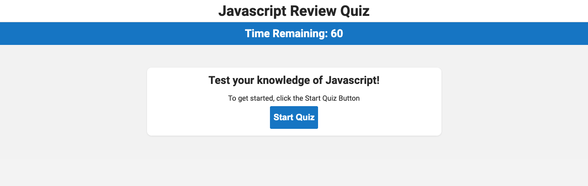

# JavaScript Quiz

## Description

This is a timed quiz on JavaScript fundamentals that stores high scores. The quiz is built with HTML, CSS, and JavaScript.

## Deployed On GitHub Pages

[JavaScript Quiz](https://jdhawks2132.github.io/javascript-quiz/)

## User Story

- AS A coding boot camp student
  - I WANT to take a timed quiz on JavaScript fundamentals that stores high scores
    - SO THAT I can gauge my progress compared to my peers

## Acceptance Criteria

- GIVEN I am taking a code quiz
  - WHEN I click the start button
    - THEN a timer starts and I am presented with a question
  - WHEN I answer a question
    - THEN I am presented with another question
  - WHEN I answer a question incorrectly
    - THEN time is subtracted from the clock
  - WHEN all questions are answered or the timer reaches 0
    - THEN the game is over
  - WHEN the game is over
    - THEN I can save my initials and score
